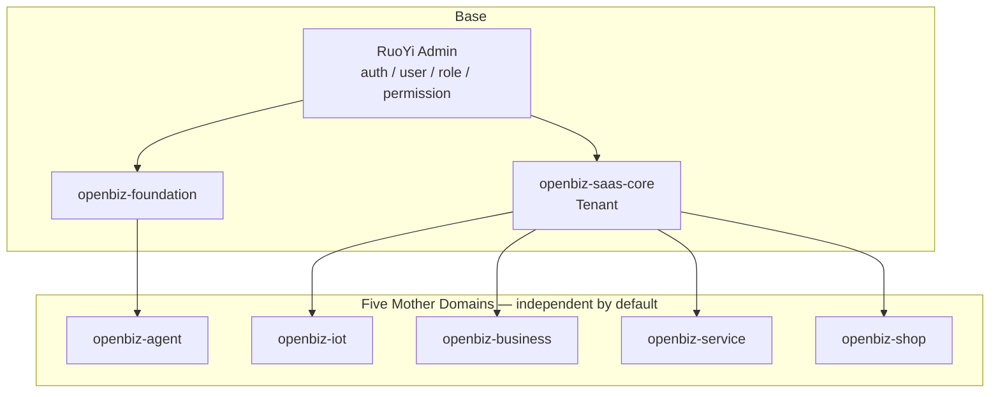

# OpenBiz

> 面向真实业务项目复用的 Java 业务母仓库。

将 10 年 Java / 全栈项目经验沉淀为 **IoT · Business · Service · Agent · Shop** 五大业务母域。通过模块化复用与 AI Coding，按真实需求裁剪与组合，快速形成可验证的业务底座——而不是堆砌一个“大而全”的框架。

**Java 21 · Spring Boot 3 · MyBatis · MySQL · Maven · AI API**

Based on [RuoYi-Vue](https://gitee.com/y_project/RuoYi-Vue) admin stack；前端不在本 monorepo。

---

## Why OpenBiz?

在 MES、IoT、CRM、ERP、OA 与各类企业业务系统中，大量能力会反复出现：设备与命令、客户与账户、工单状态、商品库存、以及对大模型的受控调用。

OpenBiz 把过去实际项目中反复出现的业务问题，以及当前仓库中经过测试验证的实现，沉淀为相互独立的业务母域。面对新项目时：

```text
需求 → 选择母域 → 裁剪不需要的能力 → 组合 → 形成项目基础
```

一个项目不必使用全部母域。可以只用 IoT，或 Business + Service，或 Agent + Business，或仅 Shop。

工程原则（简写）：

- **Reuse Before Abstraction** — 先复用已有证据，再抽象
- **Evidence Before Claims** — 有测试与代码再写进文档
- **No Big-Bang Refactor** — 不做无证据的大爆炸改造
- **No Future-Proofing Without Evidence** — 不为想象中的未来提前造平台

---

## Core Domains

| Domain | Responsibility | Current Status |
| --- | --- | --- |
| **IoT** | Device / Product / ThingModel / DeviceCommand / Protocol；Access · Locker · Charging · MES | v1.0 **FROZEN** |
| **Business** | Customer · Account · Ledger · Item · Order（账户扣款交易） | Phase 1 **COMPLETE / FROZEN** |
| **Service** | WorkOrder（创建 / 分派 / 接单 / 完成 / 取消 + 状态机） | Phase 1 **COMPLETE / FROZEN** |
| **Agent** | PromptTemplate · AgentInvocation · ModelPort · OpenAI-compatible adapter | Phase 1 **COMPLETE / FROZEN** |
| **Shop** | Product · Inventory（CAS）· ShopOrder | Phase 1 **COMPLETE / FROZEN** |

共享底座（非业务母域）：

| Module | Role |
| --- | --- |
| `openbiz-foundation` | 极薄技术基础（无业务对象） |
| `openbiz-saas-core` | Tenant / Member / `TenantContext`（与 Foundation **独立**） |

Maven 一级模块：`openbiz-iot` · `openbiz-business` · `openbiz-service` · `openbiz-agent` · `openbiz-shop` · `openbiz-foundation` · `openbiz-saas-core`。

---

## Architecture



- **RuoYi**：登录认证、用户 / 角色 / 权限、系统管理基础设施。
- **OpenBiz**：业务母域能力沉淀。
- 五大母域默认**互不 Maven 依赖**；业务域通过 `openbiz-saas-core` 使用租户能力；Agent 仅依赖 Foundation。
- IoT 虽合并为一个 jar，内部仍保留 package 边界：`iot.core` / `iot.mqtt` / `access` / `locker` / `charging` / `mes`。

---

## Why not just RuoYi?

RuoYi 是优秀的**管理端基座**，本仓库直接使用其：

- 登录与 JWT
- 用户 / 角色 / 菜单权限
- 系统字典、日志等基础能力

OpenBiz **不是**“重新发明 RuoYi”，而是在其上沉淀：

| RuoYi | OpenBiz |
| --- | --- |
| 谁可以登录、有什么菜单权限 | 设备如何下发命令、账户如何并发扣款、工单如何约束状态、库存如何 CAS、如何可替换接入大模型 |

> RuoYi = 基础管理平台 · OpenBiz = 业务能力母仓库

---

## Engineering Evidence

只记录代码与测试已证明的能力。

### Business

- `BigDecimal` / `Money` 金额处理
- 账户 `version` 乐观锁
- DB 唯一约束支撑幂等键
- 事务一致性（扣款失败回滚）
- **REAL MySQL** 多线程并发消费：余额不出现负值（`BizMysqlTest.concurrentConsumeNeverGoesNegative`）
- 跨租户访问拒绝（Customer / Account / Order）

Business Order = **账户扣款交易**，不是 Shop 商品订单。

### Shop

- Inventory 使用 `version + quantity >= requested` 的条件更新实现 **CAS 扣减**，避免 `SELECT → UPDATE` 带来的并发超卖
- 下单事务：CAS 失败则整单回滚
- 幂等下单
- 租户隔离
- **REAL MySQL** `stock = 1`、两并发请求 → **恰好 1 SUCCESS**、库存归 0（`ShopMysqlTest.concurrentBuyStockOne`）

未实现：购物车、支付、SKU、优惠券、物流、退款、售后。

### Service

- 唯一规则源：`WorkOrderTransitions`
- 合法路径：`CREATED → ASSIGNED → ACCEPTED → COMPLETED`；`CREATED|ASSIGNED → CANCELLED`
- CAS 风格状态更新（`WHERE status = from`）
- Accept / Complete 仅 **assignee** 可执行
- 租户隔离 + 幂等创建（含 MySQL 验证）

未实现：CRM、完整售后、SLA、附件体系。

### IoT

- Device / Product / ThingModel / DeviceCommand
- `DeviceCommand → ProtocolPortRegistry → ProtocolPort`（含 Mock 协议）
- `TenantGuard` + mapper `tenant_id` 隔离
- 行业能力：Access / Locker / Charging / MES（同模块、分 package）

### Agent

- `PromptTemplate → AgentInvoker → ModelPort → OpenAiCompatibleModelAdapter`
- JDK `HttpClient` + Jackson · OpenAI-compatible `/chat/completions`
- `ToolPort` 仅为最小占位接口

当前刻意保持 **最小 AI Application Core**，不为“看起来像 Agent 平台”引入尚未有真实需求的基础设施。

---

## Validation

已验证类型：

- Unit Test
- MySQL Integration Test（Business / Service / Shop）
- Concurrency Test（Business 扣款 · Shop 库存）
- Tenant Isolation
- Idempotency
- Transaction / Rollback

```bash
mvn clean test                 # PASS（Agent RealModelE2E 无 key 时 skip）
mvn clean package -DskipTests  # PASS
```

**Agent Real Model E2E** is intentionally skipped when no API key is configured（`OPENBIZ_AGENT_BASE_URL` / `OPENBIZ_AGENT_API_KEY` / `OPENBIZ_AGENT_MODEL`）。**不得理解为已完成真实大模型线上验收。**

---

## AI Application

OpenBiz 不只是传统 Java Business Backend，也沉淀 **Java Backend × AI Application** 最小闭环：

```text
PromptTemplate → AgentInvocation → ModelPort → OpenAI-compatible Adapter → chat/completions
```

模型供应商通过 `ModelPort` 可替换；密钥走环境变量，仓库不提交 API Key。

未实现（Deferred，不算缺口）：RAG · Memory · MCP · Workflow · Multi-Agent · Function Calling · ToolRegistry。

---

## AI Coding

本仓库开发过程大量使用 AI Coding 辅助实现，但 **AI 不决定架构边界**。

建议流程：

1. 明确业务母域归属  
2. 阅读模块结构与边界  
3. 检查是否已有可复用能力  
4. Reuse Before Abstraction  
5. 最小实现  
6. 编写测试  
7. `mvn clean test`  
8. 必要时 REAL MySQL / 可选 Model E2E  
9. 更新文档  
10. Stop  

> AI 提高实现速度；人负责边界、架构与验证。

---

## Quick Start

**前提**

- JDK **21**
- Maven 3.8+
- MySQL

**数据库初始化**（脚本位于 `sql/`）：

```text
sql/
├── RuoYi 基础库
├── OpenBiz SaaS
├── OpenBiz IoT（含 Access / Locker / Charging / MES）
├── OpenBiz Business
├── OpenBiz Service
└── OpenBiz Shop
```

**配置**

- `ruoyi-admin/src/main/resources/application.yml` — 默认端口 **18080**
- `application-druid.yml` — 本地 Demo 数据源（**非生产**；生产须替换密码与 JWT secret）

**启动**

```bash
mvn clean package -DskipTests
# 运行 ruoyi-admin 产物（或 IDE 启动 com.ruoyi.RuoYiApplication）
```

Probe 需先登录拿到 Token（RuoYi `/login`）。示例（本机）：

```http
GET  http://localhost:18080/openbiz/test/tenant
POST http://localhost:18080/openbiz/test/shop/products
```

Probe API 主要用于开发阶段验证，不代表正式业务 API 设计。更多路径：`/openbiz/test/iot/**`、`/openbiz/test/biz/**`、`/openbiz/test/service/**`。

---

## Documentation

| Doc | Note |
| --- | --- |
| [docs/openbiz-final-audit.md](docs/openbiz-final-audit.md) | 最终封库审计 |
| [docs/architecture-sealed.md](docs/architecture-sealed.md) | 架构封存（当前 7 模块布局） |
| [docs/openbiz-architecture.md](docs/openbiz-architecture.md) | 架构说明 |
| [docs/module-boundary.md](docs/module-boundary.md) | 模块边界 |
| [docs/business-phase1-report.md](docs/business-phase1-report.md) | Business Phase 1 |
| [docs/service-phase1-report.md](docs/service-phase1-report.md) | Service Phase 1 |
| [docs/agent-phase1-report.md](docs/agent-phase1-report.md) | Agent Phase 1 |
| [docs/shop-phase1-report.md](docs/shop-phase1-report.md) | Shop Phase 1 |
| [docs/coding-rules.md](docs/coding-rules.md) | 编码硬约束 |

IoT 演进记录见 `docs/phase1*.md` / `docs/phase2.0-java21-e2e-report.md`。

---

## Roadmap

### Current

五大母域 MVP 已完成并 **冻结**。代码以复用与展示为主，不为“更漂亮”继续扩架构。

### Next

基于**真实项目需求**继续验证与裁剪复用。

> 新能力必须来自真实业务，而不是为了增加模块数量。

RAG / MCP / Multi-Agent / Payment / Coupon / Logistics 等均为 **Deferred**，不是当前承诺。

---

## About

**一口三个馍 / 高数老师**

Java / Full-Stack Developer · AI Application Developer

10 年 Java / 全栈开发经验。关注：**Java Backend × AI Application × AI Coding**。

项目经验覆盖：IoT / MES / CRM / ERP / OA / Enterprise Systems / AI Applications。

- GitHub：https://github.com/gao-shu  
- Site：https://gao-shu.github.io/my-vitepress-site  
- 本仓库远程（规划）：https://github.com/gao-shu/openbiz  
